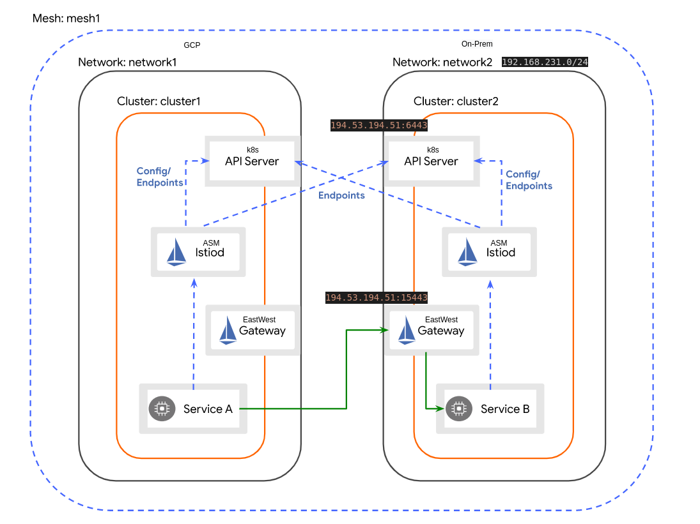
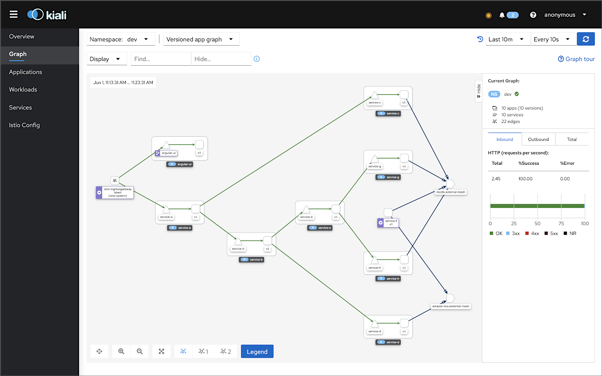

# Guide

This guide will help you setup 2 GKE clusters one in GCP and one on-prem (I'll use 2 bare-metal machines)

Pre-requisites:

- Google account with sufficient credit on it (trial period will do), $15/day should be sufficient
- Google project with sufficient permissions
- 3 bare metal machines with next specs (2 of them will be cluster nodes, one for master and one for worker, third will be jump host (one we're going to use to provision everything inclusding cluster on bare-metal)):
  - 4 core CPU or better
  - 16Gb RAM or more
  - 110Gb Storage or more

- [Guide](#guide)
  - [GKE Cluster Install](#gke-cluster-install)
    - [Anthos on bare-metal setup](#anthos-on-bare-metal-setup)
    - [Anthos in GCP setup](#anthos-in-gcp-setup)
  - [Anthos Service Mesh Install](#anthos-service-mesh-install)
    - [Anthos Service Mesh on bare-metal](#anthos-service-mesh-on-bare-metal)
      - [kube-api server SAN fix](#kube-api-server-san-fix)
      - [Expose eastwest gateway](#expose-eastwest-gateway)
    - [Anthos Service Mesh on GKE in GCP](#anthos-service-mesh-on-gke-in-gcp)
    - [Setup multi-cluster](#setup-multi-cluster)
    - [Verify](#verify)
      - [Deploy Helloworld](#deploy-helloworld)
      - [Verify Endpoints](#verify-endpoints)
      - [Verify Traffic flow](#verify-traffic-flow)
    - [Verify with Bank of Anthos](#verify-with-bank-of-anthos)
    - [Observability in bare-metal Istio setup](#observability-in-bare-metal-istio-setup)
  - [Config Management](#config-management)
  - [Cloud Run for Anthos](#cloud-run-for-anthos)
  - [Discovered Limitations](#discovered-limitations)

This is a modified picture from Istio docs that contains IP and subnets from this setup



## GKE Cluster Install

We need to provision two fresh empty clusters. One will run on bare-metal machines and leverage `bmctl` cli second will be provisioned in GCP using `gcloud` cli. Bare-metal cluster provisioning requires quite powerfull machines to run the cluster as well as a machine to run the provisioner itself.

### Anthos on bare-metal setup

- I'm going to use [Ubuntu](https://cloud.google.com/anthos/clusters/docs/bare-metal/latest/installing/configure-os/ubuntu) 20.04.3 LTS as a host OS for bare-metal setup, other distributions supported as well
- All the hosts will be placed in the same private L2 network: 192.168.231.0/24
- Master node will have IP address: 192.168.231.211
- Worker node will have IP address: 192.168.231.212
- MetalLB will use pool: 192.168.231.102-192.168.231.109
- ControlPlaneVIP: 192.168.231.101 (this IP will be used by haproxy to enable HA for control-plane nodes)
- IngressVIP: 192.168.231.102
- Cluster name will be: `kra-bm-1`
- Google project id will be: `asmtest-331513`

> Reference: https://cloud.google.com/anthos/clusters/docs/bare-metal/latest/quickstart

OS on the bare-mteal host must be prepared to install GKE, multiple OS flavors are supported. Basically we need to install container runtime - docker (GKE uses containerd, probably this is a requirement for backward compatibility with installation scripts) and disable firewall. Please note GKE uses cilium as a CNI so that Linux Kernel 4.9+ is requred. Depending of your OS choice you could use root or regular user with passwordless sudo.

1. [Setup](https://cloud.google.com/anthos/clusters/docs/bare-metal/latest/installing/configure-os/ubuntu) your nodes (master and worker):

    > Docker version matters, as of k8s 1.21 docker 19.03 is required

    ```bash
    sudo ufw disable
    sudo apt-get remove docker docker-engine docker.io containerd runc
    sudo apt-get update
    sudo apt-get install \
        apt-transport-https \
        ca-certificates \
        curl \
        gnupg-agent \
        software-properties-common \
        docker.io
    sudo docker version
    ```

2. Add your user to sudoers with passwordless option (add `YOUR_USER_NAME ALL = (ALL) NOPASSWD: ALL` to the end of the file `/etc/sudoers`) on all k8s nodes

    ```bash
    sudo visudo /etc/sudoers
    ```

3. From jump host add you ssh key to the k8s nodes:

    ```bash
    ssh-keygen -t rsa
    ssh-copy-id -i ~/.ssh/identity_file your_user@cluster_node_ip
    ```

4. [Install](https://cloud.google.com/sdk/docs/install#installation_instructions) gcloud
5. Install kubectl:

    ```bash
    gcloud components install kubectl
    ```

6. On a jump host [download](https://cloud.google.com/anthos/clusters/docs/bare-metal/latest/quickstart#installing-bmctl) `bmctl`:

    ```bash
    cd ~
    mkdir baremetal
    cd baremetal
    gsutil cp gs://anthos-baremetal-release/bmctl/1.9.1/linux-amd64/bmctl bmctl
    chmod a+x bmctl
    ./bmctl -h
    ```

7. On a jump host prepare manifest template and enable google APIs for the cluster:

    > Get your project_id from google web console. I'll use `kra-bm-1` as my bare-metal cluster name and `asmtest-331513` as google project id

    ```bash
    ./bmctl create config -c kra-bm-1 --enable-apis --create-service-accounts --project-id=asmtest-331513
    ```

    As a result a manifest should be generated: `bmctl-workspace/kra-bm-1/kra-bm-1.yaml`

8. Modify the [manifest](https://cloud.google.com/anthos/clusters/docs/bare-metal/latest/quickstart#edit-config) accordingly

    There is an [example](./kra-bm-1.yaml) I used for my cluster

    My cluster reside in a private network and doesn't have a Public IP, public IP is required by Istio to provide service discovery usin kube-apiserver and app traffic flow via eastwest-gateway (see the [Istio multi-cluster setup](https://istio.io/latest/docs/setup/install/multicluster/multi-primary_multi-network/)). There is an option to change [LB configuration](https://cloud.google.com/anthos/clusters/docs/bare-metal/latest/installing/load-balance) from bundled to manual but I don't have access to LB so I asked admin to forward few ports to my master node, it should be sufficient for demo purposes. More about it in ASM section.

9. [Create](https://cloud.google.com/anthos/clusters/docs/bare-metal/latest/quickstart#preflight-checks) the cluster

    ```bash
    ./bmctl create cluster -c kra-bm-1
    ```

    `bmctl` will perform checks and if anything went wrong you could check the logs

10. Check your cluster:

    ```bash
    kubectl --kubeconfig bmctl-workspace/kra-bm-1/kra-bm-1-kubeconfig get nodes
    ```

11. [Register](https://cloud.google.com/anthos/multicluster-management/console/logging-in#logging_in_using_a_bearer_token) your cluster to Anthos console:

    Add new kubeconfig to KUBECONFIG env var and set kuseconfig to use new context

    ```bash
    export KUBECONFIG=~/.kube/config:/home/aokhotnikov/baremetal/bmctl-workspace/kra-bm-1/kra-bm-1-kubeconfig
    kubectl config use-context kra-bm-1-admin@kra-bm-1
    ```

    ```bash
    cat <<EOF > cloud-console-reader.yaml
    kind: ClusterRole
    apiVersion: rbac.authorization.k8s.io/v1
    metadata:
      name: cloud-console-reader
    rules:
    - apiGroups: [""]
      resources: ["nodes", "persistentvolumes", "pods"]
      verbs: ["get", "list", "watch"]
    - apiGroups: ["storage.k8s.io"]
      resources: ["storageclasses"]
      verbs: ["get", "list", "watch"]
    EOF
    kubectl apply -f cloud-console-reader.yaml
    ```

    ```bash
    KSA_NAME=anthos-sa
    kubectl create serviceaccount ${KSA_NAME}
    kubectl create clusterrolebinding anthos-view --clusterrole view --serviceaccount default:${KSA_NAME}
    kubectl create clusterrolebinding anthos-ccr --clusterrole cloud-console-reader --serviceaccount default:${KSA_NAME}
    ```

    ```bash
    kubectl create clusterrolebinding anthos-admin --clusterrole cluster-admin --serviceaccount default:anthos-sa
    ```

    Get token:

    ```bash
    SECRET_NAME=$(kubectl get serviceaccount anthos-sa -o jsonpath='{$.secrets[0].name}')
    kubectl get secret ${SECRET_NAME} -o jsonpath='{$.data.token}' | base64 --decode
    ```

    Use the token in google Anthos console to register the cluster

### Anthos in GCP setup

> All commands were performed from jump host if other wasn't specified

- Cluster name will be: `cluster-1`
- Google project id will be: `asmtest-331513`
- Zone will be: `europe-central2-a`

1. From jump host create cluster using `gcloud` cli:

    > Using 3 `e2-standard-4` nodes as it is a mnimum suitable size to handle the basic workload with ASM

    ```bash
    gcloud container clusters create cluster-1 --project=asmtest-331513 --zone=europe-central2-a --machine-type=e2-standard-4 --num-nodes=3 --workload-pool=asmtest-331513.svc.id.goog
    ```

2. Register cluster to Anthos: go to the Anthos console select Clusters and click Register for the new cluster

## Anthos Service Mesh Install

> Note: we're going to perform hybrid multi-cluster setup, so ASM installation will be modified. Due to these modifications we're going to install ASM with control-plane in-cluster mode.

- By default network will be set to `default` and it leads to wrong endpoint discovery
- ClusterName and MeshID overriden for simplicity
- Vanilla Istio [multi-cluster](https://istio.io/latest/docs/setup/install/multicluster/multi-primary_multi-network/) setup is underlied here
- `FLEET_PROJECT_ID` will be the same as Google project ID - `asmtest-331513`, more about the fleets [here](https://cloud.google.com/anthos/multicluster-management/fleets)

Anthos Service Mesh (ASM) is a Google modified Istio. Accordingly to documentation as of time of writing ASM doesn't support hybrid multi-cluster setups, you can setup multi-cluster connectivity in cloud or between on-prem, but not between cloud and on-prem. Vanilla Istio doesn't divide the way cluster is installed and it's setup-agnostic in some way, so I'm going to leverage that and apply steps from Istio's multi-cluster different networks guide. Please note Google ships their own flavor of `istioctl` and it will provision configs with ASM-based control and worker planes for service mesh, but it is still Istio under the hood.

### Anthos Service Mesh on bare-metal

> All commands were performed from jump host if other wasn't specified

1. Ensure you're using the bare-metal context from setup above:

    ```bash
    export KUBECONFIG=~/.kube/config:/home/aokhotnikov/baremetal/bmctl-workspace/kra-bm-1/kra-bm-1-kubeconfig
    kubectl config use-context kra-bm-1-admin@kra-bm-1
    ```

2. [Download](https://cloud.google.com/service-mesh/docs/unified-install/get-started#download_asmcli) `asmcli`

    ```bash
    curl https://storage.googleapis.com/csm-artifacts/asm/asmcli_1.11 > asmcli
    chmod +x asmcli
    ```

3. Grant admin permissions to your Google account (use your google login)

    ```bash
    kubectl create clusterrolebinding cluster-admin-binding --clusterrole=cluster-admin --user=USER_ACCOUNT
    ```

4. [Optional] [Validate](https://cloud.google.com/service-mesh/docs/unified-install/get-started#validate_project_and_cluster) the cluster

5. Prepare an `overlay` file for the bare-metal cluster (this is an override file for default IstioOperator)

    > `meshID` will be the same for both clusters, `clusterName` and `network` will be unique for each of them

    ```bash
    cat <<EOF > kra-bm-1-asm-overlay.yaml
    ---
    apiVersion: install.istio.io/v1alpha1
    kind: IstioOperator
    spec:
      values:
        global:
          multiCluster:
            clusterName: cluster1
          meshID: mesh1
          network: network1
    EOF
    ```

6. [Install](https://cloud.google.com/service-mesh/docs/unified-install/install#install_with_optional_features) ASM:

    ```bash
    ./asmcli install \
        --fleet_id asmtest-331513 \
        --kubeconfig /home/aokhotnikov/baremetal/bmctl-workspace/kra-bm-1/kra-bm-1-kubeconfig \
        --output_dir kra-bm-1-output \
        --platform multicloud \
        --enable_all \
        --ca mesh_ca \
        --custom_overlay kra-bm-1-asm-overlay.yaml
    ```

7. Re-label `istio-system` namespace accordingly:

    ```bash
    kubectl label namespace istio-system topology.istio.io/network=network1 --overwrite
    ```

8. [Install](https://cloud.google.com/service-mesh/docs/unified-install/off-gcp-multi-cluster-setup#install_the_east-west_gateway) eastwest gateway

    ```bash
    kra-bm-1-output/asm/istio/expansion/gen-eastwest-gateway.sh \
        --mesh mesh1 \
        --cluster cluster1 \
        --network network1 \
        --revision asm-1112-17 | \
        kra-bm-1-output/istioctl --kubeconfig=/home/aokhotnikov/baremetal/bmctl-workspace/kra-bm-1/kra-bm-1-kubeconfig install -y --set spec.values.global.pilotCertProvider=kubernetes -f -
    ```

9. [Expose](https://cloud.google.com/service-mesh/docs/unified-install/off-gcp-multi-cluster-setup#exposing_services) the services:

    ```bash
    kubectl apply -n istio-system -f  kra-bm-1-output/asm/istio/expansion/expose-services.yaml
    ```

That should be it, but my setup requires additional configuration as kube-apiserver nor the eastwest gateway are not exposed to the internet. Each cluster must be able to reach the eastwest gateway and kube-api server of the other cluster. I asked to setup edge firewall as follows:

> Note: this is a workaround and must not be used for production setup

- Forward port 6443 to my ControlPlaneVIP and port 443 (as it specified in bmctl cluster manifest): <PublicIP>:6443 -> 192.168.231.101:443
- Forward port 15443 to my master node to port 30685 (this is a NodePort for eastwest-gateway service, could be any port from NodePort range): <PublicIP>:30685 -> 192.168.231.211:6443

#### kube-api server SAN fix

In case you will try to reach kube-api with kubectl you'll get an error that this TLS endpoint not specified in the certificate SAN list. Here is how to fix it:

> `192.168.231.101:443` is my ControlPlaneVIP

1. Get all the current SANs from host

    ```bash
    openssl s_client -connect 192.168.231.101:443 </dev/null 2>/dev/null | openssl x509 -noout -text | grep DNS:
    ```

2. SSH to bare-metal mater node
3. [bare-metal mater node] Get the current `kubeadm.yaml`

    ```bash
    kubectl -n kube-system get configmap kubeadm-config -o jsonpath='{.data.ClusterConfiguration}' > kubeadm.yaml
    ```

4. [bare-metal mater node] Add the external IP and all the existing SANs to `kubeadm.yaml` as the `apiServer.certSANs` list:

    > Public IP is `194.53.194.51`

    ```yaml
    apiServer:
        certSANs:
           - krk-gke-1
           - kubernetes
           - kubernetes.default
           - kubernetes.default.svc
           - kubernetes.default.svc.cluster.local
           - 10.96.0.1
           - 192.168.231.211
           - 192.168.231.101
           - 194.53.194.51
        extraArgs:
    ...
    ```

5. [bare-metal mater node] Backup old keys and apply the new `kubeadm.yaml`

    ```bash
    mv /etc/kubernetes/pki/apiserver.{crt,key} ~
    kubeadm init phase certs apiserver --config kubeadm.yaml
    ```

6. [bare-metal mater node] Restart kube-api container or the whole server

#### Expose eastwest gateway

Eastwest gateway will automatically acquire External IP from MetalLB, but it will be an IP in private subnet, and we need to expose it to the internet.

1. Open eastwest gateway service to edit:

    ```bash
    kubectl -n istio-system edit svc istio-eastwestgateway
    ```

2. Set `externalIPs:` and change service type to NodePort:

    > My Public IP is `194.53.194.51` and public port for eastwest gateway is `30685`

    ```yaml
    ...
    spec:
      type: NodePort
      externalIPs:
      - 194.53.194.51
      ports:
      - name: tls
        nodePort: 30685
        port: 15443
        protocol: TCP
        targetPort: 15443
    ...
    ```

    Your eastwest gateway should look like similar to this:

    ```bash
    aokhotnikov@krk-gke-1:~$ kubectl -n istio-system get svc
    NAME                    TYPE        CLUSTER-IP    EXTERNAL-IP     PORT(S)                                                           AGE
    istio-eastwestgateway   NodePort    10.96.2.45    194.53.194.51   15021:31151/TCP,15443:30685/TCP,15012:30348/TCP,15017:30179/TCP   24m
    ```

### Anthos Service Mesh on GKE in GCP

> All commands were performed from jump host if other wasn't specified

> You can list contexts with `kubectl config get-contexts`

1. Ensure you're using the cloud context from setup above:

    ```bash
    kubectl config use-context gke_asmtest-331513_europe-central2-a_cluster-1
    ```

2. Grant admin permissions to your Google account (use your google login)

    ```bash
    kubectl create clusterrolebinding cluster-admin-binding --clusterrole=cluster-admin --user=USER_ACCOUNT
    ```

3. [Optional] [Validate](https://cloud.google.com/service-mesh/docs/unified-install/get-started#validate_project_and_cluster) the cluster

4. Prepare an `overlay` file for the bare-metal cluster (this is an override file for default IstioOperator)

    > `meshID` will be the same for both clusters, `clusterName` and `network` will be unique for each of them

    ```bash
    cat <<EOF > cluster-1-asm-overlay.yaml
    ---
    apiVersion: install.istio.io/v1alpha1
    kind: IstioOperator
    spec:
      values:
        global:
          multiCluster:
            clusterName: cluster2
          meshID: mesh1
          network: network2
    EOF
    ```

5. [Install](https://cloud.google.com/service-mesh/docs/unified-install/install#install_with_optional_features) ASM:

    ```bash
    ./asmcli install \
        --fleet_id asmtest-331513 \
        --project_id asmtest-331513 \
        --output_dir cluster-1-output \
        --cluster_location europe-central2-a \
        --cluster_name cluster-1 \
        --enable_all \
        --ca mesh_ca \
        --custom_overlay cluster-1-asm-overlay.yaml
    ```

6. Re-label `istio-system` namespace accordingly:

    ```bash
    kubectl label namespace istio-system topology.istio.io/network=network2 --overwrite
    ```

7. [Install](https://cloud.google.com/service-mesh/docs/unified-install/off-gcp-multi-cluster-setup#install_the_east-west_gateway) eastwest gateway

    ```bash
    cluster-1-output/asm/istio/expansion/gen-eastwest-gateway.sh \
        --mesh mesh1 \
        --cluster cluster2 \
        --network network2 \
        --revision asm-1112-17 | \
        cluster-1-output/istioctl install -y --set spec.values.global.pilotCertProvider=kubernetes -f -
    ```

8. [Expose](https://cloud.google.com/service-mesh/docs/unified-install/off-gcp-multi-cluster-setup#exposing_services) the services:

    ```bash
    kubectl apply -n istio-system -f  cluster-1-output/asm/istio/expansion/expose-services.yaml
    ```

### Setup multi-cluster

Now we need to create secrets so that each cluster can gather all the required information from others

next command performs steps similar to [Istio endpoint discovery](https://istio.io/latest/docs/setup/install/multicluster/multi-primary_multi-network/#enable-endpoint-discovery)

> All commands were performed from jump host if other wasn't specified

1. Run the secret creation and apply them to the clusters

    > Full path to kubeconfig files is required

    ```bash
     ./asmcli create-mesh \
      asmtest-331513 \
      /home/aokhotnikov/baremetal/bmctl-workspace/kra-bm-1/kra-bm-1-kubeconfig \
      /home/aokhotnikov/baremetal/cluster-1-output/asm_kubeconfig
      ```

My ControlPlaneVIP for bare-metal cluster is private IP so remote cluster will try to reach bare-metal using private IP and will fail, we need to update the secret in the remote (GCP) cluster

1. Ensure you're using the cloud context from setup above:

    ```bash
    kubectl config use-context gke_asmtest-331513_europe-central2-a_cluster-1
    ```

2. Search for remote cluster secret in `istio-system` namespace

    ```bash
    kubectl -n istio-system get secret
    ```

    Mine was named as `istio-remote-secret-kra-bm-1-admin-kra-bm-1` and entry was named as `kra-bm-1-admin-kra-bm-1`

3. Gather secret contents:

    ```bash
    kubectl -n istio-system get secret istio-remote-secret-kra-bm-1-admin-kra-bm-1 -o jsonpath='{$.data.kra-bm-1-admin-kra-bm-1}' | base64 --decode > istio-remote-secret-kra-bm-1-admin-kra-bm-1.yaml
    ```

4. Open and edit `server:` stanza:

    > My Public IP and port for kube-api in bare-mteal cluster was `94.53.194.51:6443`

    ```bash
    vi istio-remote-secret-kra-bm-1-admin-kra-bm-1.yaml
    ```

    Set `server:` item accordingly

    ```yaml
    server: https://194.53.194.51:6443
    ```

5. Apply new secret:

    ```bash
    kubectl -n istio-system delete secret istio-remote-secret-kra-bm-1-admin-kra-bm-1
    kubectl -n istio-system create secret generic istio-remote-secret-kra-bm-1-admin-kra-bm-1 --from-file=kra-bm-1-admin-kra-bm-1=istio-remote-secret-kra-bm-1-admin-kra-bm-1.yaml
    ```

6. Restart `istio-system` workloads:

    ```bash
    kubectl -n istio-system rollout restart deployment
    ```

### Verify

> Reference: https://cloud.google.com/service-mesh/docs/unified-install/gke-install-multi-cluster#verify_your_deployment

#### Deploy Helloworld

> All commands were performed from jump host if other wasn't specified

Bare-metal cluster:

1. Get Istio revision

    > In this installation Istio revision label was `istio.io/rev=asm-1112-17`

    ```bash
    kubectl --context kra-bm-1-admin@kra-bm-1 -n istio-system get pods -l app=istiod --show-labels
    ```

2. Create and label `sample` namespace in both clusters:

    ```bash
    kubectl --context kra-bm-1-admin@kra-bm-1 create ns sample
    kubectl label --context kra-bm-1-admin@kra-bm-1 namespace sample istio-injection- istio.io/rev=asm-1112-17 --overwrite
    ```

3. Install `helloworld v1`

    ```bash
    cat <<EOF > kra-bm-1-helloworld-v1.yaml
    apiVersion: v1
    kind: Service
    metadata:
      name: helloworld
      namespace: sample
      labels:
        app: helloworld
        service: helloworld
    spec:
      ports:
      - port: 5000
        name: http
      selector:
        app: helloworld
    ---
    apiVersion: apps/v1
    kind: Deployment
    metadata:
      name: helloworld-v1
      namespace: sample
      labels:
        app: helloworld
        version: v1
    spec:
      replicas: 1
      selector:
        matchLabels:
          app: helloworld
          version: v1
      template:
        metadata:
          labels:
            app: helloworld
            version: v1
        spec:
          containers:
          - name: helloworld
            image: docker.io/istio/examples-helloworld-v1
            resources:
              requests:
                cpu: "100m"
            imagePullPolicy: IfNotPresent #Always
            ports:
            - containerPort: 5000
    EOF
    kubectl --context kra-bm-1-admin@kra-bm-1 apply -f kra-bm-1-helloworld-v1.yaml

4. Deploy the `sleep` service:

    ```bash
    cat <<EOF > kra-bm-1-sleep.yaml
    apiVersion: v1
    kind: ServiceAccount
    metadata:
      name: sleep
      namespace: sample
    ---
    apiVersion: v1
    kind: Service
    metadata:
      name: sleep
      namespace: sample
      labels:
        app: sleep
        service: sleep
    spec:
      ports:
      - port: 80
        name: http
      selector:
        app: sleep
    ---
    apiVersion: apps/v1
    kind: Deployment
    metadata:
      name: sleep
      namespace: sample
    spec:
      replicas: 1
      selector:
        matchLabels:
          app: sleep
      template:
        metadata:
          labels:
            app: sleep
        spec:
          terminationGracePeriodSeconds: 0
          serviceAccountName: sleep
          containers:
          - name: sleep
            image: curlimages/curl
            command: ["/bin/sleep", "3650d"]
            imagePullPolicy: IfNotPresent
            volumeMounts:
            - mountPath: /etc/sleep/tls
              name: secret-volume
          volumes:
          - name: secret-volume
            secret:
              secretName: sleep-secret
              optional: true
    EOF
    kubectl --context kra-bm-1-admin@kra-bm-1 apply -f kra-bm-1-sleep.yaml
    ```

GCP cluster:

1. Get Istio revision

    > In this installation Istio revision label was `istio.io/rev=asm-1112-17`

    ```bash
    kubectl --context gke_asmtest-331513_europe-central2-a_cluster-1 -n istio-system get pods -l app=istiod --show-labels
    ```

2. Create and label `sample` namespace in both clusters:

    ```bash
    kubectl --context gke_asmtest-331513_europe-central2-a_cluster-1 create ns sample
    kubectl label --context gke_asmtest-331513_europe-central2-a_cluster-1 namespace sample istio-injection- istio.io/rev=asm-1112-17 --overwrite
    ```

3. Install `helloworld v2`

    ```bash
    cat <<EOF > cluster-1-helloworld-v2.yaml
    apiVersion: v1
    kind: Service
    metadata:
      name: helloworld
      namespace: sample
      labels:
        app: helloworld
        service: helloworld
    spec:
      ports:
      - port: 5000
        name: http
      selector:
        app: helloworld
    ---
    apiVersion: apps/v1
    kind: Deployment
    metadata:
      name: helloworld-v2
      namespace: sample
      labels:
        app: helloworld
        version: v2
    spec:
      replicas: 1
      selector:
        matchLabels:
          app: helloworld
          version: v2
      template:
        metadata:
          labels:
            app: helloworld
            version: v2
        spec:
          containers:
          - name: helloworld
            image: docker.io/istio/examples-helloworld-v2
            resources:
              requests:
                cpu: "100m"
            imagePullPolicy: IfNotPresent #Always
            ports:
            - containerPort: 5000
    EOF
    kubectl --context gke_asmtest-331513_europe-central2-a_cluster-1 apply -f cluster-1-helloworld-v2.yaml

4. Deploy the `sleep` service:

    ```bash
    cat <<EOF > cluster-1-sleep.yaml
    apiVersion: v1
    kind: ServiceAccount
    metadata:
      name: sleep
      namespace: sample
    ---
    apiVersion: v1
    kind: Service
    metadata:
      name: sleep
      namespace: sample
      labels:
        app: sleep
        service: sleep
    spec:
      ports:
      - port: 80
        name: http
      selector:
        app: sleep
    ---
    apiVersion: apps/v1
    kind: Deployment
    metadata:
      name: sleep
      namespace: sample
    spec:
      replicas: 1
      selector:
        matchLabels:
          app: sleep
      template:
        metadata:
          labels:
            app: sleep
        spec:
          terminationGracePeriodSeconds: 0
          serviceAccountName: sleep
          containers:
          - name: sleep
            image: curlimages/curl
            command: ["/bin/sleep", "3650d"]
            imagePullPolicy: IfNotPresent
            volumeMounts:
            - mountPath: /etc/sleep/tls
              name: secret-volume
          volumes:
          - name: secret-volume
            secret:
              secretName: sleep-secret
              optional: true
    EOF
    kubectl --context gke_asmtest-331513_europe-central2-a_cluster-1 apply -f kra-bm-1-sleep.yaml
    ```

#### Verify Endpoints

> All commands were performed from jump host if other wasn't specified

Bare-metal cluster

1. Ensure you're using the bare-metal context:

    ```bash
    kubectl config use-context kra-bm-1-admin@kra-bm-1
    ```

2. Check the endpoints:

    ```bash
    kra-bm-1-output/istioctl proxy-config endpoint $(kubectl -n sample get pod -l app=sleep --output=jsonpath={.items..metadata.name}).sample | grep hello
    ```

You should get two endpoints: one local to your bare-metal cluster and second one is remote with public ip of the eastwest gateway in the GCP cluster and port 15443

GCP cluster

1. Ensure you're using the GCP context:

    ```bash
    kubectl config use-context gke_asmtest-331513_europe-central2-a_cluster-1
    ```

2. Check the endpoints:

    ```bash
    kra-bm-1-output/istioctl proxy-config endpoint $(kubectl -n sample get pod -l app=sleep --output=jsonpath={.items..metadata.name}).sample | grep hello
    ```

You should get two endpoints: one local to your GCP cluster and second one is remote with public ip of the eastwest gateway in the bare-metal cluster and port 15443, in my case it was `194.53.194.51:15443`

If you see only local pod IP then probably you misconfigured secret for remote cluster, check the istiod logs. Also there is a great [troubleshoot guide](https://istio.io/latest/docs/ops/diagnostic-tools/multicluster/)

#### Verify Traffic flow

Bare-metal cluster

1. Ensure you're using the bare-metal context:

    ```bash
    kubectl config use-context kra-bm-1-admin@kra-bm-1
    ```

2. Check the responses:

    ```bash
    for i in $(seq 1 10);do kubectl -n sample -c sleep exec $(kubectl -n sample get pod -l app=sleep -o jsonpath='{.items[0].metadata.name}') -- curl -sS helloworld.sample:5000/hello;done
    ```

You should see responses from v1 and v2 pods

GCP cluster

1. Ensure you're using the bare-metal context:

    ```bash
    kubectl config use-context gke_asmtest-331513_europe-central2-a_cluster-1
    ```

2. Check the responses:

    ```bash
    for i in $(seq 1 10);do kubectl -n sample -c sleep exec $(kubectl -n sample get pod -l app=sleep -o jsonpath='{.items[0].metadata.name}') -- curl -sS helloworld.sample:5000/hello;done
    ```

You should see responses from v1 and v2 pods

Also you could investigate Anthos Service Mesh Console, but only data from GCP cluster will be available there

### Verify with Bank of Anthos

There is an example app from Google called `Bank of Anthos`, it contains frontend, backend and DB pods, you can place these pods to your clusters to test service-mesh. You can find manifests here:

- First part of BoA (+helloworld): https://github.com/xadcoh/anthos/tree/main/cluster-1
- Second part of BoA (+helloworld): https://github.com/xadcoh/anthos/tree/main/krk-bm-1

### Observability in bare-metal Istio setup

> All commands were performed from jump host if other wasn't specified

There is a GUI for Istio that help you visualize the telemetry: [Kiali](https://kiali.io/)



I'm going to use integrations manifests from official [Istio docs](https://istio.io/latest/docs/ops/integrations/)

> Kiali requires Prometheus. Also there could be limited functionality as we're using ASM and not the vanilla Istio

1. Ensure you're using the bare-metal context:

    ```bash
    kubectl config use-context kra-bm-1-admin@kra-bm-1
    ```

2. Apply [prometheus](https://istio.io/latest/docs/ops/integrations/prometheus/) manifest:

    ```bash
    kubectl apply -f https://raw.githubusercontent.com/istio/istio/release-1.11/samples/addons/prometheus.yaml
    ```

3. Apply [Kiali](https://istio.io/latest/docs/ops/integrations/kiali/) manifest:

    ```bash
    kubectl apply -f https://raw.githubusercontent.com/istio/istio/release-1.11/samples/addons/kiali.yaml
    ```

4. Expose Kiali using `port-forward`

    ```bash
    kubectl port-forward -n istio-system svc/kiali 20001:20001
    ```

5. Point you browser to http://localhost:20001

Check other integrations as well

## Config Management

As we registered both of our clusters to Anthos we can deliver stuff to them using Anthos Config Management.

Navigate to Anthos console, select Config Management, click `SETUP` (if you didn't setup Config Management earlier) and define parameters for each cluster.

Configuration is staightforward, as bare minimum, you need to define git repo, auth if needed and `Policy directory` - a folder with k8s manifests you'd like to apply to your k8s cluster.

For testing purposes I'm using these two folders from my personal GitHub repo (no auth is required):

> google-credentials json file could be required for BoA, you could find one in kube-system namespace or create new one

- First part of BoA (+helloworld): https://github.com/xadcoh/anthos/tree/main/cluster-1
- Second part of BoA (+helloworld): https://github.com/xadcoh/anthos/tree/main/krk-bm-1

Config Management is quite limited, for example it will perform pre-flight checks (`nomos`) but it won't track status of the deployed resources.

## Cloud Run for Anthos

Cloud run for Anthos works fine on GKE in GCP but I experienced troubles installing it on bare-metal setup. There is a [guide](https://cloud.google.com/anthos/run/docs/install/outside-gcp) for Clusters Outside Google Cloud and docs claim that all I need is to enable APIs, enable Cloud Run feature and then I'll able to install Cloud Run via CRD, but my bare-metal cluster (registered in fleet, with enabled APIs and Cloud Run feature) lacks this CRD and I'm stuck gathering it.

## Discovered Limitations

- Anthos Service Mesh can be configured only in in-cluster control plane setup (Google hosted service mesh control plane configuration is lmited). This is a question about hybrid setup.
- Google Console represents Service Mesh data from GKE on GCP only (no bare-metal data). Same as Istio in multi-cluster setup with control plane in each cluster.
- Config Management is limited to sync git state to the cluster(s) without much flexibility
- Cloud Run for Anthos didn't work on bare-metal in my case